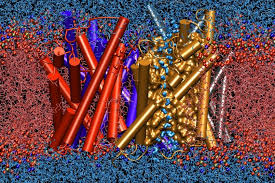

#My favorite gene
## AQP

By Ivone Giffard

#     
    This is the story of the AQP protein from a fish 

Aquaporins are integral membrane proteins from a larger family of major intrinsic proteins (MIP) that form pores in the membrane of biological cells.[1]

Genetic defects involving aquaporin genes have been associated with several human diseases.[2][3] The 2003 Nobel Prize in Chemistry was awarded jointly to Peter Agre for the discovery of aquaporins,[4] and Roderick MacKinnon for his work on the structure and mechanism of potassium channels.[5] The plasma membranes of a variety of different animal and plant cells contain aquaporins through which water can flow more rapidly inside the cell than by diffusing through the phospholipid bilayer.[6]

Here is the protein

<https://www.youtube.com/watch?v=1Uw6u0fzNsE>
<https://youtu.be/1Uw6u0fzNsE>

<http://www.ks.uiuc.edu/Research/aquaporins/>

<http://localhost:8888/notebooks/Untitled.ipynb?kernel_name=python2>

<http://www.sciencedirect.com/science/article/pii/S1095643307010501>

Dicentrarchus labrax aquaporin 1 (AQP1) mRNA, complete cds
GenBank: DQ924529.3
GenBank Graphics
>gi|124269015|gb|DQ924529.3| Dicentrarchus labrax aquaporin 1 (AQP1) mRNA, complete cds
GACCTCAGACCCACAGCCGGACAGCCACACTGCCACCACCATGAGAGAATTCAAGAGCAAGGACTTCTGG
AGGGCCGTTCTGGCCGAACTGGTTGGCATGACCCTTTTTATTTACCTCAGCATCTCCACAGCAATTGGGA
ACCCGAACAATTCCAACCCAGACCAGGAGGTGAAGGTGTCGCTGGCATTCGGACTGGCCATTGCCACGCT
GGCCCAGAGTTTAGGCCACATCAGCGGAGCCCACCTGAACCCTGCAGTTACCCTCGGGATGCTTGCCAGC
TGCCAGATCAGCGTGTTCAAGGCAGTCATGTATATTGTGGCCCAGATGCTGGGTTCAGCCCTGGCCAGTG
GCATTGTGTATGGAGCACGTCCAAGTGGCAATCTTGCACTGGGGCTCAACTCTCTCAACAATGTCACTCC
TAGCCAAGGCGTGGGCATAGAGCTCCTGGCAACCTTCCAGCTGGTACTGTGTGTCATTGCAGTCACTGAT
AAAAGGCGGCGTGATGTCACCGGCTCAGCGCCATTGGCCATTGGCCTCTCAGTCTGCCTGGGACACTTGG
CAGCAATCAGCTACACAGGCTGCGGCATCAATCCCGCTCGCTCCTTTGGTCCGGCTTTGATCCTGAACGA
TTTCACAGACCACTGGGTGTACTGGGTGGGGCCAATGTGTGGTGGTGTTGCAGCAGCTCTCATATACGAT
TTCCTGCTGTCCCCGAAATTTGATGACTTCCCTGAGAGAATGAAGGTCCTGGTCAGTGGCCCAGTGGGTG
ACTACGACGTTAACGGAGGCAATGACGCTACGACTGTGGAGATGACGTCAAAATAGTTCCACACTGTCAC
AACTACTTAGTTTCATTGTACATGTCTATACTCCTGTAAAAAAAAAAAAAAGCTCTTGAATGTAGTTTAG
GATTTCAGTTTTTTTGTGCTATTTTGAAATACCAATGAGATTTGTGGTAACGGGTCAGTTAGTGTTTCTT
TCTAATTCACTCCTTTGTTTGACCCCATACACAATTTTCACCCAGCTGCCGCTCGAGCATACAA

aquaporin 1 [Dicentrarchus labrax]
GenBank: ABI95464.2
GenPept Identical Proteins Graphics
>gi|124269016|gb|ABI95464.2| aquaporin 1 [Dicentrarchus labrax]
MREFKSKDFWRAVLAELVGMTLFIYLSISTAIGNPNNSNPDQEVKVSLAFGLAIATLAQSLGHISGAHLN
PAVTLGMLASCQISVFKAVMYIVAQMLGSALASGIVYGARPSGNLALGLNSLNNVTPSQGVGIELLATFQ
LVLCVIAVTDKRRRDVTGSAPLAIGLSVCLGHLAAISYTGCGINPARSFGPALILNDFTDHWVYWVGPMC
GGVAAALIYDFLLSPKFDDFPERMKVLVSGPVGDYDVNGGNDATTVEMTSK

